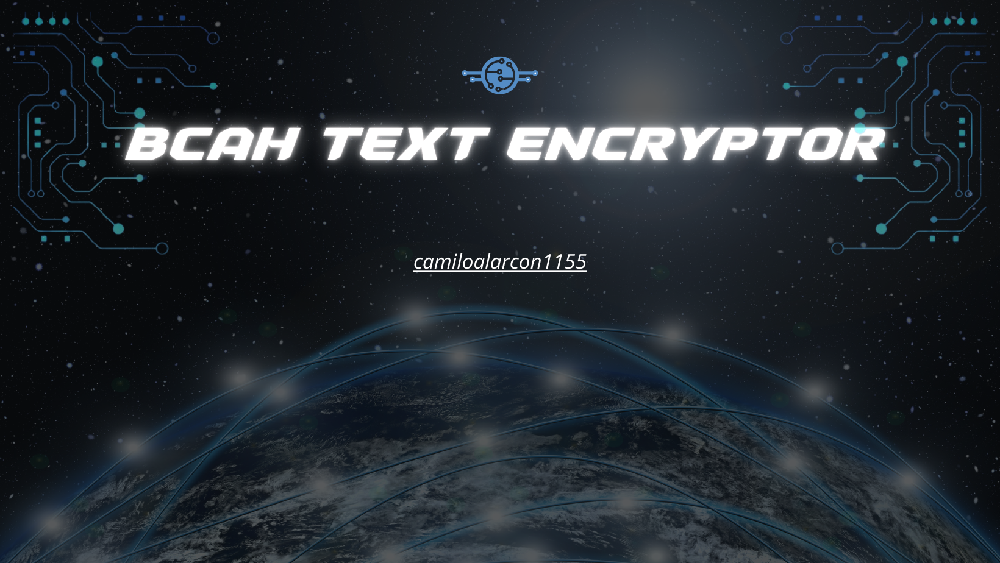
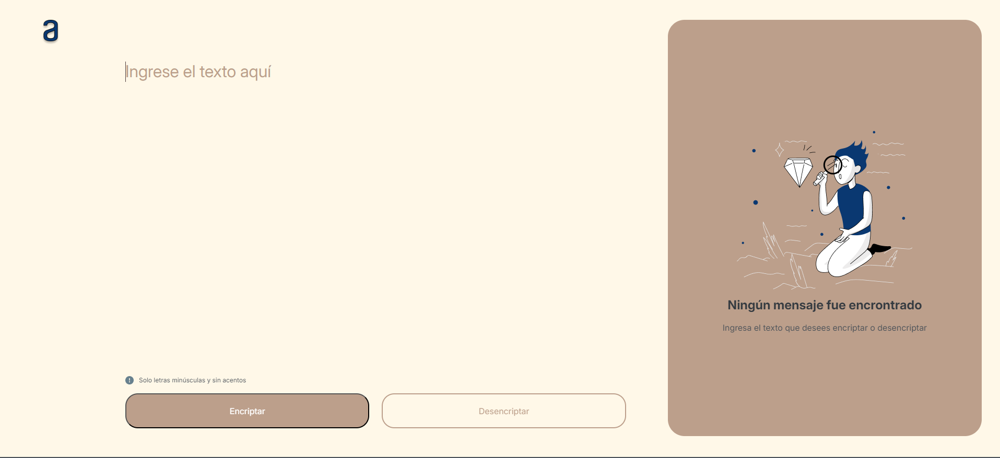
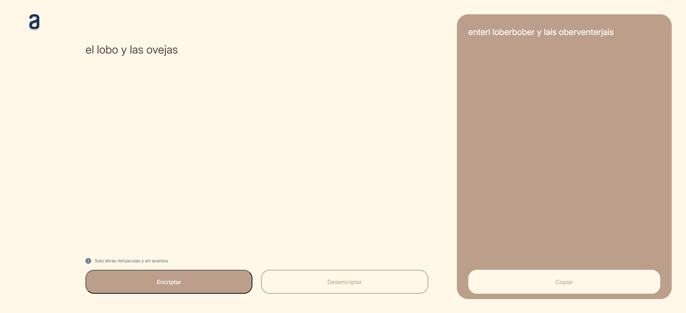
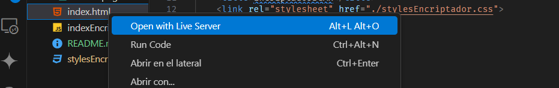

## Título del proyecto 

<h1 align="center">Encriptador de Texto BCAH</h1>


## Imagen de portada




## Insignias

       


## Índice

- [Título del proyecto](#título-del-proyecto)
- [Imagen de portada](#imagen-de-portada)
- [Insignias](#insignias)
- [Índice](#índice)
- [Descripción del proyecto](#descripción-del-proyecto)
- [Estado del proyecto](#estado-del-proyecto)
- [Características de la aplicación y demostración](#características-de-la-aplicación-y-demostración)
- [📁 Acceso al proyecto](#-acceso-al-proyecto)
- [🛠️ Abre y ejecuta el proyecto](#️-abre-y-ejecuta-el-proyecto)
- [Tecnologías utilizadas](#tecnologías-utilizadas)
- [Autores](#autores)
- [Licencia](#licencia)


## Descripción del proyecto

**Encriptador de Texto BCAH** es una herramienta intuitiva diseñada para encriptar y desencriptar texto mediante un método sencillo y eficiente. El proyecto está orientado a usuarios que desean mantener ciertos datos encriptados para proteger información sensible o simplemente para experimentar con técnicas básicas de cifrado.


## Estado del proyecto

Esta sección muestra el estado actual del proyecto mediante insignias informativas.

- **Fecha de Lanzamiento**:   
- **Estado del Proyecto**:   
- **Fecha Última Actualización**: 


## Características de la aplicación y demostración

- **Funcionalidad 1**: Encriptación de Texto  
  Permite al usuario ingresar texto en la sección de entrada y encriptar las vocales del texto mediante un método de sustitución, mientras que las consonantes permanecen inalteradas.

- **Funcionalidad 2**: Desencriptación de Texto  
  Permite al usuario ingresar texto en la sección de entrada y desencriptar las vocales que fueron encriptadas con el mismo método, devolviendo el texto a su forma original.

- **Funcionalidad 3**: Interfaz de Usuario Dividida  
  - **Funcionalidad 3a**: Sección de Entrada  
    Área donde el usuario puede ingresar el texto y seleccionar la acción (encriptar o desencriptar).
  - **Funcionalidad 3b**: Sección de Salida  
    Área que muestra el texto encriptado o desencriptado resultante de la acción seleccionada.

- **Funcionalidad 4**: Botón de Copiado  
  Ofrece la opción de copiar el texto encriptado o desencriptado al portapapeles, permitiendo al usuario pegar el texto en otros documentos o aplicaciones.




## 📁 Acceso al proyecto

- **Acceso al Proyecto en Línea**: Puedes ver y usar el proyecto en línea a través del siguiente enlace: [Encriptador de Texto BCAH](https://camiloalarcon1155.github.io/text-encryptor-challenge/).

- **Código Fuente del Proyecto**: El código fuente está disponible en GitHub. Puedes acceder al repositorio del proyecto aquí: [Repositorio en GitHub](https://github.com/camiloalarcon1155/text-encryptor-challenge/tree/improvements). El repositorio consta de 2 ramas: main e improvements. En la rama main se encuentra la primera parte del challenge con la mayoria de las especificaciones basicas, pedidas en el challenge de Alura Latam. En la rama improvements se encuentran algunos cambios hechos al proyecto como personalizaciones en el layout o uso de funciones y pseudoclases, ademas de la incorporacion del archivo README.md, el archivo .gitignore. La rama improvements contiene el contenido completo del challenge.


## 🛠️ Abre y ejecuta el proyecto

Para abrir y ejecutar el proyecto localmente, sigue estos pasos:

1. **Clona el Repositorio**: Usa Git para clonar el repositorio a tu máquina local con el siguiente comando:
   ```bash
   git clone https://github.com/camiloalarcon1155/text-encryptor-challenge.git

2. **Navega al Directorio del Proyecto**: Una vez clonado, accede al directorio del proyecto:
   ```bash
   cd text-encryptor-challenge

3. **Abre el Proyecto**: Abre el archivo index.html en tu navegador web preferido. Puedes hacerlo directamente arrastrando el archivo al navegador o usando la opción de abrir archivo en el navegador. puedes usar el siguiente codigo git para abrir una carpeta completa con tu proyecto: 
   ```bash
   code ./ -r

5. **Ejecuta el Proyecto**: No es necesario ningún servidor o configuración adicional para ejecutar este proyecto. Solo necesitas un navegador web para ver y utilizar la aplicación. Puedes usar el live server de visual studio Code para conectar con tu navegador: 
   
   


## Tecnologías utilizadas

   - JavaScript
   - HTML
   - CSS
   - GitHub


## Autores

| [<br><sub>Camilo Alarcón Hoyos</sub>](https://github.com/camilafernanda) | [<br><sub>aluraLATAM</sub>](https://www.aluracursos.com/) |
| :---: | :---: |


## Licencia

Este proyecto es parte de un challenge de [Alura Latam](https://www.aluracursos.com/). 

- **Licencia**: El proyecto se distribuye bajo la [Licencia MIT](https://opensource.org/licenses/MIT). 


